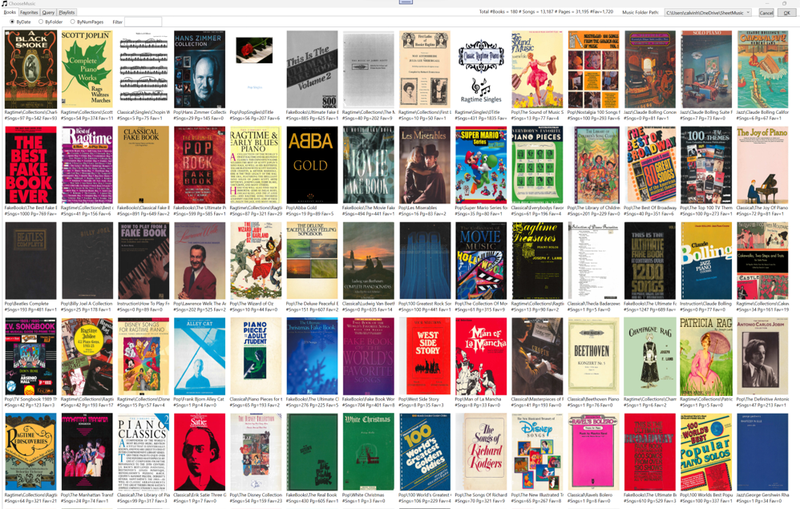
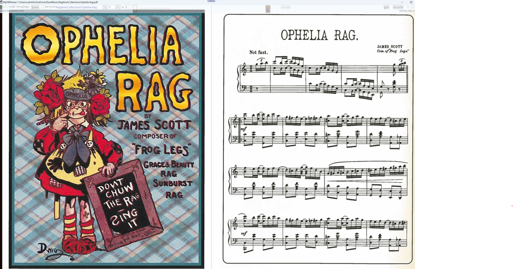

# SheetMusicViewer

PDF Sheet Music Viewer by Calvin Hsia 2019

Allows users to view downloaded or scanned Sheet Music in PDF format to play on a musical instrument, such as a piano.

**Runs on:** Windows 10/11, macOS, and Linux  
**Updated 2025:** Migrated from WPF to Avalonia UI for cross-platform support.



## Features

* Display 1 or 2 pages at a time (side by side)
* Mark any page as a Favorite and quickly navigate between favorites
* Add ink annotations (stylus, mouse, or finger) - original PDFs are never modified
* Instant page turns with intelligent caching - no waiting during performances
* Multi-volume book support (large books split across multiple PDFs)
* Table of Contents with search by composer, title, etc.
* Remembers your last viewed page for each book

---

# 🎹 For Musicians

*This section is for musicians who want to install and use SheetMusicViewer to view their sheet music.*

## Quick Start

1. **Download** the app from the [Releases page](https://github.com/calvinhsia/SheetMusicViewer/releases)
2. **Extract** and run it
3. **Select** your folder containing PDF sheet music
4. **Play!**

## Installation

### Download

| Platform | File |
|----------|------|
| Windows (64-bit) | `SheetMusicViewer-win-x64.zip` |
| Linux (64-bit) | `SheetMusicViewer-linux-x64.tar.gz` |
| macOS Apple Silicon (M1/M2/M3) | `SheetMusicViewer-osx-arm64.tar.gz` |

### Windows Step-by-Step

1. **Download the ZIP file**
   - Go to the [Releases page](https://github.com/calvinhsia/SheetMusicViewer/releases)
   - Click on `SheetMusicViewer-win-x64.zip` to download
   - The file will save to your Downloads folder (usually `C:\Users\YourName\Downloads`)

2. **Extract the ZIP file**
   - Open File Explorer and navigate to your Downloads folder
   - Find `SheetMusicViewer-win-x64.zip`
   - Right-click on the file and select **"Extract All..."**
   - Choose where to extract (e.g., `C:\SheetMusicViewer` or your Desktop)
   - Click **"Extract"**

3. **Run the application**
   - Open the folder where you extracted the files
   - Double-click on **`SheetMusicViewer.exe`**

4. **Handle the Windows SmartScreen warning** (first run only)
   - Windows may show a blue **"Windows protected your PC"** warning
   - This appears because the app is not from the Microsoft Store
   - Click **"More info"**
   - Click **"Run anyway"**
   - This is normal for open-source software and only appears once

5. **Select your music folder**
   - On first run, you'll be asked to choose a folder containing your PDF music files
   - Navigate to where your sheet music PDFs are stored
   - Click **"Select Folder"**

> **Tip:** Create a desktop shortcut for easy access: Right-click `SheetMusicViewer.exe` → **"Create shortcut"** → drag the shortcut to your Desktop.

### Linux

```bash
# Extract the archive
tar -xzf SheetMusicViewer-linux-x64.tar.gz

# Make it executable
chmod +x SheetMusicViewer

# Run the application
./SheetMusicViewer
```

### macOS

```bash
# Extract the archive
tar -xzf SheetMusicViewer-osx-arm64.tar.gz

# Remove quarantine (required for unsigned apps)
xattr -cr SheetMusicViewer

# Make it executable
chmod +x SheetMusicViewer

# Run the application
./SheetMusicViewer
```

> **Note:** If you see "app is damaged" or "can't be opened" messages, run the `xattr -cr` command above. This is Apple's Gatekeeper blocking unsigned applications.

## Using the App

### Display Modes
- **Single page mode**: Shows one page at a time (best for portrait orientation)
- **Two page mode**: Shows two pages side by side (like an open book)

### Navigation
- **Arrow keys**: Navigate forward/backward by one screenful
- **Page Up/Down**: Navigate by one screenful
- **Home/End**: Jump to first/last page
- **Slider**: Drag to quickly navigate through the entire book
- **Touch/Click**: Tap the bottom quarter of the screen to turn pages

### Favorites
- Click the **Fav** checkbox to mark a page as a favorite
- Use the **< >** buttons to jump between favorites
- Great for marking the start of each piece in a songbook

### Inking (Annotations)
1. Click the **Ink** checkbox to enable inking mode
2. Draw with your mouse, stylus, or finger
3. Right-click to change ink color (red, black, or highlight)
4. Click the **Ink** checkbox again to save and exit ink mode

> **Tip:** Zoom in before inking to make precise corrections easier.

### Organizing Your Music

**Multi-volume books**: Name files `Book0.pdf`, `Book1.pdf`, `Book2.pdf`, etc. They'll be treated as one book.

**Singles folders**: Create a folder ending in "Singles" (e.g., `JazzSingles`) and each PDF inside is treated as a separate song.

**Hidden folders**: Any subfolder named "Hidden" will be ignored.

## Why Instant Page Turns Matter

When playing piano, **page turns must be instantaneous**. You can't pause mid-performance to wait for a page to load.

SheetMusicViewer uses intelligent caching to pre-render upcoming pages while you're playing. When you turn the page, it appears instantly - just like turning a physical page.

## Troubleshooting

| Issue | Solution |
|-------|----------|
| App won't start | Make sure you extracted the ZIP file first (don't run from inside the ZIP) |
| SmartScreen warning | Click "More info" → "Run anyway" (this is normal for unsigned apps) |
| Pages load slowly | Your PDF may be very high resolution. Print it to "Microsoft Print to PDF" to reduce size |
| Can't find my music | Use the Chooser (Alt+C) to select a different music folder |

---

# 👩‍💻 For Developers

*This section is for developers who want to build, modify, or contribute to SheetMusicViewer.*

## Building from Source

```bash
# Clone the repository
git clone https://github.com/calvinhsia/SheetMusicViewer.git
cd SheetMusicViewer

# Build the solution
dotnet build SheetMusicViewer.sln

# Run the Avalonia Desktop app
dotnet run --project SheetMusicViewer.Desktop
```

## Project Structure

| Project | Description |
|---------|-------------|
| `SheetMusicViewer.Desktop` | Cross-platform Avalonia UI application |
| `SheetMusicLib` | Shared library with core business logic |
| `SheetMusicViewer` | Original WPF application (Windows only) |
| `Tests` | Unit and integration tests for WPF version |
| `AvaloniaTests` | Tests for Avalonia version |

## Creating a Release

The project uses GitHub Actions for CI/CD. To create a new release:

1. **Ensure you're on the `main` branch** with all changes merged:
   ```bash
   git checkout main
   git pull origin main
   ```

2. **Tag the commit** with a version number starting with `v`:
   ```bash
   git tag v1.0.0
   git push origin v1.0.0
   ```

3. **GitHub Actions will automatically**:
   - Build the application on Windows, macOS, and Linux
   - Run all tests on each platform
   - Create self-contained, single-file executables
   - Create a GitHub Release with downloadable binaries
   - Embed the version number in the application (visible in **Menu → About**)

4. **Version format**: Use semantic versioning (e.g., `v1.0.0`, `v1.2.3`, `v2.0.0-beta`)

> **Note**: Releases should always be created from `main` to ensure they contain stable, reviewed code.

### Listing Prior Releases

```bash
# List all version tags
git tag -l "v*"

# List tags with dates (most recent first)
git tag -l "v*" --sort=-version:refname

# Show details of a specific release
git show v1.0.0
```

## CI/CD Pipeline

Every push and pull request triggers the CI pipeline which:
- Builds the entire solution on Windows, macOS, and Linux
- Runs all unit and integration tests
- Creates platform-specific artifacts (available for 30 days)

See `.github/workflows/ci.yml` for the full workflow configuration.

## Testing Strategy

### Test Suite Overview
- ✅ **70 Unit Tests** - Fast, isolated tests for core business logic
- ✅ **37 Integration Tests** - Tests for file I/O, PDF APIs, and component interactions
- ✅ **100% Pass Rate** - All executable tests passing consistently

### Test Categories

**Unit Tests** (`TestCategory="Unit"`):
- PDF metadata management and serialization
- Multi-volume PDF handling logic
- Favorites and bookmark management
- Table of Contents parsing and maintenance

**Integration Tests** (`TestCategory="Integration"`):
- Windows.Data.Pdf API integration
- File system operations (save/load metadata)
- PDF document loading and page rendering
- Error handling with corrupted files

### Why No Code Coverage Metrics?

Code coverage tools like `coverlet` cannot instrument WinExe projects. This is a [known limitation](https://github.com/coverlet-coverage/coverlet/issues/1158) affecting Windows desktop applications.

We prioritize test comprehensiveness over coverage percentages.

---

# 📖 Technical Details

## How PDF Books Are Organized

Your PDFs are never modified. All metadata (favorites, ink, TOC, last page viewed) is stored in `.json` files alongside your PDFs.

### Multi-Volume Books

Large books can be split across multiple PDF files:
- First file: `book.pdf` or `book0.pdf`
- Subsequent files: `book1.pdf`, `book2.pdf`, etc.

All files with the same root name are treated as one book.

### Singles Folders

Folders ending in "Singles" (e.g., `GershwinSingles`) treat each PDF as a separate song. The folder maintains an alphabetical TOC automatically.

### Page Number Offset

Scanned books often have printed page numbers that don't match PDF page numbers (due to cover pages, introductions, etc.). The `PageNumberOffset` setting maps between them so your TOC matches the printed page numbers.

## Performance: Intelligent Page Caching

**Single Page Mode** (showing page 5):
- Cache contains: pages 4, 5, 6, 7
- When you turn to page 6, page 8 is immediately queued

**Two Page Mode** (showing pages 5-6):
- Cache contains: pages 3, 4, 5, 6, 7, 8
- Forward/backward turns are instant

**Multi-Volume Books**:
- Volumes are loaded asynchronously as you approach boundaries
- Last pages of volume N and first pages of volume N+1 are both cached

---

# 📝 About the Author

I have a few hundred piano music books that I've collected over several decades. I keep them on OneDrive so I can access them from any machine.

I love to play piano, especially ragtime. Most of my books were "perfect bound" which means they didn't stay open on the piano music stand. I rebound them using plastic comb binding to make playing easier.

When I got a Microsoft Surface Book 2 with a large enough display, I decided to digitize my 30,000+ pages of music. I tried various sheet music viewers but wasn't satisfied, so I wrote my own.

**How I got started on piano:** I've never had a piano lesson! In Junior High, our PDP-8 computer could emit radio interference on the AM dial - making music through the radio. I remember hearing Maple Leaf Rag. In college, there was a piano in my fraternity, and I started picking through the notes of Maple Leaf Rag.

I really love Ragtime. There's something so binary about it: powers of 2, 16 measures per verse, 2/4 time, syncopation.


*Ophelia Rag by James Scott, 1910*

---

📧 **Contact:** calvin_hsia@alum.mit.edu  
🌐 **Website:** [calvinhsia.com](http://calvinhsia.com)


